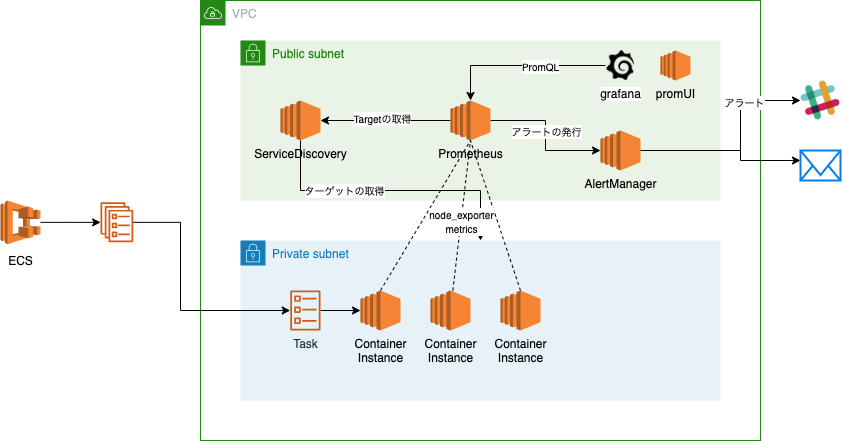

# prom_services_example

## 概要

ECSでgit管理されたprometheus/alertmanagerを動かす。

## システム構成図



## 適用方法

```
# 1
# ./alertconf/config.yamlの${webhook_url}を任意の値に修正する
# 2
# .template.docker-compose.yamlからdocker-compose.yamlを作成してクレデンシャルを適用する
```

## 参考情報

[Prometheus - overview](https://prometheus.io/docs/introduction/overview/)


## Build & Deployment

```sh
# prometheus
$ cd /path/to/repository/
$ docker build -t prom . -f _prom.dockerfile

# alert managerの場合
$ docker build -t alert-manager . -f _alert.dockerfile
```

## 開発手順

ディレクトリ構成

```
├── _alert.dockerfile // alertmanagerのコンテナ
├── _prom.dockerfile  // promethuesのコンテナ
├── alert_manager
│   └── template.config.yaml // alertの通知先の設定
└── prom
    ├── rules.yml // アラートの設定
    └── template.prometheus.yml // メトリクス取得の設定, Service Discoveryの設定
```

開発 / 動作確認

```sh
$ cd /path/to/repository/

# ソースコードを変更した後に
$ docker-compose build
$ docker-compose up
```